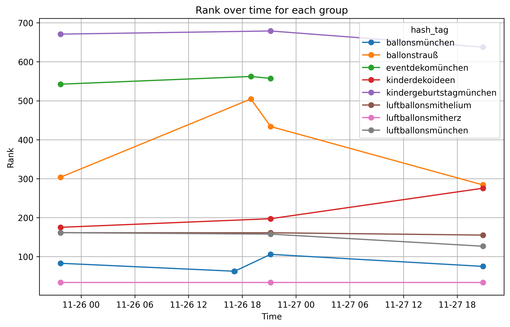

# Hash Tag Performance Analyzer project
This project uses Facebook Graph API for reading information related to hashtags. To read hashtag information we use endpoints:
1. To read codes for given hashtag we use `GET /ig_hashtag_search` -- https://developers.facebook.com/docs/instagram-platform/instagram-graph-api/reference/ig-hashtag-search
1. For further engagement analisys we use `GET /<ig_hashtag>/top-media` -- https://developers.facebook.com/docs/instagram-platform/instagram-graph-api/reference/ig-hashtag/top-media

## Algorithm description

1. Let `H` be a list of the hashtags. For each `h` from `H`:
  - Save `time_add = now()`
  - Fetch vector `(L, C, P)` for max `max_load_media` topmost medias for given hashtag `h` using endpoint `/<ig_hashtag>/top-media`, where `L` - number of likes, `C` - number of comments, `P` - number of media that referes hashtag `h`: `min(number_of_loaded_media, max_load_media)`. We use max_load_media = 100 to limit load on Facebook API. In future we can increase this parmeter.
  - compute average values `(L, C, P)` over all loaded medias for given `time_add` and `h`
2. doing operations above for each day we will get for each `time_add` and `h` triple `(avg(L), avg(C), avg(P))` that can be treated as value `(L, C, P)` for every date.
3. Compute Weighted Rang $R(L, C, P) =  w_1 L + w_2  C + w_3  P$
4. For each hastag `h` compute its effectiveness between dates $d_1 < d_2$ by formula using derivatives:
```math
  E(h) = \frac{R_{d_2}(L, C, P) - R_{d_1}(L, C, P)}{d_2 - d_1}
```

Our assumption is that the number of likes $L$, comments $C$, and the number of pages $P$ are parameters of a weighted linear Rank function `R`, which is _implicitly_ proportional to the engagement value.

```math
R(L, C, P) = w_1 L + w_2  C + w_3  P
```

The weights of these parameters, `w_i`, can be determined later during statistical analysis.

# How to run
## Activate venv:

```python -m venv venv```
## Install dependencies
```pip install -r requirements.txt```

## Run script
```python main.py <FACEBOOK_TOKEN>```

This programm will read information from Facebook Graph API and store all rows to `storage.csv` file. Each run of programm will **add** records with `time_add=now()` column value to the end of file.
Previous verion of file will be backed up with timestamp and `.bkp` extension.

## Results
As a result of the programm run the following artifacts are produced. 
### 1. HashTags Trends Diagramm
For each hashtag the chart of the values of Rank $R(L, C, P)$ function over time will be built based on the algorithm described above. 


### 2. Efficiency and trends

Also detailed information for each hashtag is printed: Rank ($R$), Trend ($E$), and efficiency classification. 
```

                  hash_tag        rank     trends     efficiency
4  kindergeburtstagmünchen  637.659200  -2.911797  low-effective
2         eventdekomünchen  557.407229  -3.692254  low-effective
1             ballonstrauß  283.894581 -14.191143  low-effective
3          kinderdekoideen  275.447059   5.501247  low-effective
5     luftballonsmithelium  155.151515  -0.420381  low-effective
7       luftballonsmünchen  126.588235  -2.185587  low-effective
0           ballonsmünchen   74.816667   0.744714  low-effective
6       luftballonsmitherz   33.400000   0.000000  low-effective
```

The hash_tag efficiency is defined by the following rule:
```python
def _hash_tag_category(like: int, comments: int, posts: int) -> str:
    if like > 1000 or comments > 100 or posts > 10_000:
        return 'hight-effective'
    if (200 <= like <= 1000) or (20 <= comments < 100) or (1000 <= posts <= 10_000):
        return 'mid-effective'
    if like < 200 or comments < 20 or posts < 1_000:
        return 'low-effective'
```

# Storage file format
All Facebook Graph API responses are stored for future possible. The following information is stored:

|column name| type | description|
|--------|---|------|
|hash_tag|str|Name of hashtag|
|time_add|datetime|When the row is generated (moment of data fetch)|
|record_id|int| Facebook API record indentifier |
|caption| str | Text of top-media record |
|like_count| int | number of likes |
|comments_count| int | number of comments  |
|media_url|str | URL of media |
|media_type|str | type of the media |
|permalink| str | permanent link to page | 
|timestamp | datetime | date and time when post was created |


